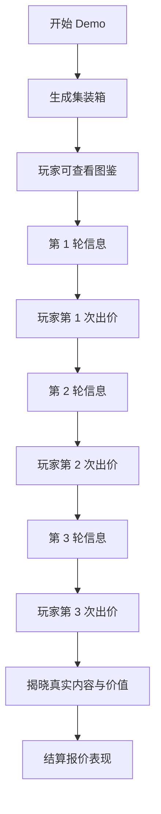

# BidKing 单人信息揭露 Demo PRD

> 支线 PRD。目标不是完整多人竞拍，而是验证：**玩家在三轮信息逐步揭露中，是否能理解集装箱价值、参考图鉴推断上下限，并形成出价决策**。

## 1. Demo 目标

本 Demo 只模拟**单人体验**：

- 系统生成一个 `5×7` 集装箱。
- 按场次等级放入若干藏品。
- 玩家初始无任何箱内信息。
- 玩家可以随时查看图鉴。
- 一共三轮信息揭露，每轮包含：
  - 公开信息
  - 私有信息
  - 集装箱可视化更新
  - 预估价值上下限更新（下限为金额；上限为 `X+？？？`，见 §9）
  - 玩家出价

Demo 验证重点：

1. **信息量化模型是否可用**：一条信息能否被量化成覆盖率。
2. **可视化是否清楚**：轮廓、品质颜色、具体物品三种层级能否在格子上表达。
3. **估值上下限是否有用**：玩家能否基于当前信息与图鉴理解「为什么下限变了、为什么可推断上界 X 变了」，并理解上限旁 **`+？？？`** 代表的自行推理空间。
4. **三轮节奏是否成立**：每轮信息是否足以让玩家调整报价，而不是只看最后一轮。

## 2. Demo 范围

### 2.1 包含

- 单人局。
- 3 轮信息揭露。
- `5×7` 集装箱格子。
- 静态图鉴。
- 按场次生成藏品。
- 信息揭露后更新格子表现。
- 信息揭露后更新预估价值上下限（展示规则见 §9）。
- 每轮玩家可输入/点击出价。
- 局末展示真实集装箱、真实总价值、玩家报价结果。

### 2.2 不包含

- 其他真实玩家。
- AI 对手。
- 多人报价推断。
- 实时竞价。
- 门票、局外成长、展馆。
- 角色技能。
- 红色藏品复杂剧情，只保留数值分支或特殊标识。

## 3. 核心流程



## 4. 集装箱与藏品生成

### 4.1 集装箱规格

- 集装箱固定为 `5×7 = 35` 格。
- 藏品占用连续格子。
- 同一局内，图鉴中的同一个藏品最多出现一次；不允许重复放入相同藏品。
- 每个藏品至少配置：
  - `id`
  - `名称`
  - `品质`：白 / 绿 / 紫 / 金 / 红
  - `类别`
  - `格子形状`
  - `固定价值`
  - `图鉴描述`

藏品标价（当前 Demo）：

- 各品质（含红色）在图鉴中均为 **固定数值**；**不按格子外再套一层「红品价值浮动」**。
- 价值 **大体随占格数递增**（同品质下格数越多通常越贵）；**少数道具故意不按「格数⇔贵贱」的直觉对齐**，用来打断「只看外形就能线性外推」的路径，逼玩家回到图鉴对款、对价，给推算增加噪声与变化。
- **估价上下界**始终只读图鉴里的 **固定标价**（含红品）；与上条不矛盾：例外是标价表设计层面的，不是局内再随机浮动。

### 4.2 场次等级

Demo 可先支持 4 个场次：

| 场次 | 目标体验 | 藏品品质倾向 | 信息倾向 |
|------|----------|--------------|----------|
| 新手场 | 易理解，小范围误判 | 白绿为主，少量紫，无红 | 公开信息强，区间收敛快 |
| 中级场 | 开始有捡漏和误判 | 绿紫为主，少量金/红 | 私有信息更重要 |
| 高级场 | 高价值判断与大风险 | 紫金为主，少量红 | 信息碎片化，区间较宽 |
| 娱乐场 | 大起大落 | 红色与高品质占比更高 | 噪声大，区间极宽 |

品质比例先使用当前建议值作为默认：

| 场次 | 白 | 绿 | 紫 | 金 | 红 |
|------|----|----|----|----|----|
| 新手场 | 35% | 45% | 18% | 2% | 0% |
| 中级场 | 20% | 40% | 30% | 8% | 2% |
| 高级场 | 10% | 25% | 40% | 20% | 5% |
| 娱乐场 | 25% | 20% | 25% | 15% | 15% |

## 5. 图鉴

玩家可随时查看图鉴。

图鉴按品质整理：

1. 白
2. 绿
3. 紫
4. 金
5. 红

每个图鉴条目展示：

- 藏品名称
- 品质颜色
- 类别
- 格子形状
- 固定价值（红品亦为图鉴标价）
- 简短说明

图鉴是玩家推断上下限的基础。Demo 中所有估值上下限都应能通过图鉴反查解释。

当信息揭示“某件藏品属于珠宝类 / 文物类 / 军品类 / 容器类”等分类时，玩家应能在图鉴中看到同一分类字段，并据此缩小候选范围。

## 6. 信息类型与可视化规则

每轮信息包含两类：

- 公开信息：系统公布，Demo 中玩家一定看到。
- 私有信息：原本用于多人信息差；Demo 中也直接给玩家，用于验证单人推理路径。

### 6.1 信息类型

| 信息类型 | 示例 | 格子表现 | 价值推断作用 |
|----------|------|----------|--------------|
| 总件数 | 集装箱内共有 9 件藏品 | 不直接画格子 | 缩小候选组合 |
| 总格子数 | 藏品共占用 17 格 | 不直接画格子 | 推断平均格子价值 |
| 品质存在 | 至少有 1 件金品 | 不直接画格子 | 缩小品质组合 |
| 红品存在性 | 有 / 没有红色藏品 | 不直接画格子 | 控制极端价值预期 |
| 格子价值 | 平均格子价值偏高 | 不直接画格子 | 直接影响总价判断 |
| 物品轮廓 | 有一件 `2×3` 藏品在某区域 | 画出轮廓 | 缩小候选物品 |
| 轮廓 + 品质 | 有一件紫色 `2×3` 藏品 | 画轮廓并覆盖品质色 | 大幅缩小候选物品 |
| 具体物品 | 这件是“青铜祭器” | 直接显示具体物品 | 基本锁定该物品价值 |

### 6.2 格子表现优先级

同一格子可能被多条信息覆盖时，按以下优先级展示：

```text
具体物品 > 轮廓 + 品质 > 纯轮廓 > 未知
```

展示规则：

- 纯轮廓：只画边框，不填品质色。
- 轮廓 + 品质：画边框，并填对应品质颜色。
- 具体物品：显示物品名或物品图标，同时保留品质颜色。
- 未知格子：保持默认未知状态。

## 7. 三轮信息释放

### 7.0 信息覆盖率节奏

Demo 需要控制三轮信息的**累计覆盖率**，用于验证玩家在不同信息阶段的报价变化。

| 轮次 | 本轮后累计信息覆盖率目标 | Demo 实现（约） | 说明 |
|------|--------------------------|-----------------|------|
| 第 1 轮后 | 约 25%～35% | 累计 ≈30% 档 | 以件数/占格/弱提示 + 轮廓或品类为主，建立粗范围 |
| 第 2 轮后 | 约 55%～65% | 累计 ≈62% 档 | 红品/品质计数/外形+品质等，明显收窄 |
| 第 3 轮后 | **约 68%～72%** | `finalTotal` 随机落在此区间 | 接近决策所需信息量，仍保留约三成不确定性 |

每轮仍然只发：

- **1 条公开信息**（**整句一条**，不再把多条子线索用分号拼成一段）
- **1 条私有信息**（**整句一条**）

**生成策略（与当前 Demo 对齐）**

- 开局先在 `plannedCoverage` 上规划三轮，使三轮结束后 **有效信息点之和** 落在 **约 68%～72%**（相对满覆盖 100% 的刻度）。
- 每轮将「本轮预算」按约 **52% / 48%**（随轮次微调）拆给公开、私有，各自只选 **一条** 原子线索；用 `深度倍率 × 有效点 − 与目标距离的惩罚` 打分，**偏好由浅入深**（首轮抬升低 `coverageLevel`，末轮抬升轮廓+品质与具体）。
- 信息权重与类型池可按场次自由调参，**不必**沿用旧版「多条弱信息拼 bundle」的规范。

信息类型不做固定脚本绑定，但与上式结合后会 **统计上** 呈现浅→深；若随机导致首轮即较强，仍合法。

- 唯一硬约束是：每轮 **恰好** 1 公开 + 1 私有，各为 **一句话**，且三轮累计覆盖率落在本节末档目标附近。

信息计分必须去重：

- 同一条真相维度重复出现时，后续重复信息不再计入覆盖率。
- 同一件藏品允许递进揭露，例如：`轮廓 → 轮廓 + 品质 → 具体物品`，但这只是允许，不是固定脚本。
- 递进揭露时只计入**新增层级**的信息量；如果后续信息没有超过已有揭露层级，则计 `0` 点。
- UI 中应能区分“原始信息点”和“实际计入覆盖率的信息点”，用于排查重复信息。

### 7.1 第 1 轮

目标：建立基本范围，让玩家知道“这箱大概是哪类箱子”。

可发信息：

- 总件数范围或精确总件数。
- 总格子数范围。
- 是否存在高品质或红品。
- 少量轮廓信息。

新手场可以给较强公开信息，例如：

- “本箱共有 9 件藏品。”
- “没有红色藏品。”
- “有一件 `2×3` 藏品。”

高级场则只给弱信息，例如：

- “箱内藏品数量不少。”
- “有一件占格较大的物品。”

### 7.2 第 2 轮

目标：让玩家开始根据图鉴排除候选。

可发信息：

- 品质存在或品质数量。
- 轮廓 + 品质。
- 某一件藏品的类别。
- 平均格子价值区间。

示例：

- “至少有 2 件紫色藏品。”
- “左上区域有一件金色 `1×2` 藏品。”
- “本箱平均格子价值处于中高档。”

### 7.3 第 3 轮

目标：给最终决策信息，但不一定完全揭晓。

可发信息：

- 具体物品揭露。
- 关键品质数量补充。
- 价值重心提示。
- 红品分支提示。

示例：

- “右侧 `2×3` 藏品确认为青铜祭器。”
- “本箱主要价值集中在 1-2 件藏品上。”
- “红色藏品存在正向结果可能，但不能确认。”

## 8. 信息量化模型

本 Demo 采用 100 点信息模型。

为了便于计算，暂时把集装箱信息与物品信息拆开，并视作独立。实际设计中二者有耦合，后续再做去重修正。

### 8.1 集装箱信息：60 点

| 信息 | 点数 | 占比 | 备注 |
|------|------|------|------|
| 总件数 | 9 | 15% | 例如：共有 9 件藏品 |
| 总格子数 | 9 | 15% | 例如：共占用 18 格 |
| 品质存在 | 15 | 25% | 例如：金 5、紫 3、白 1、绿 1 |
| 格子价值 | 15 | 25% | 平均格子价值、单位格价值区间 |
| 红品存在性 | 12 | 20% | 是否有红品，以及红品数量/方向 |

### 8.2 物品总信息：40 点

物品总信息只与**揭露单个物品**有关。

| 品质 | 点数 | 占比 |
|------|------|------|
| 红色 | 20 | 50% |
| 金色 | 10 | 25% |
| 紫色 | 7 | 17.5% |
| 白色 | 2 | 5% |
| 绿色 | 1 | 2.5% |

说明：

- 这里的点数表示“揭露一件该品质物品本身”带来的基础信息价值。
- 红色最高，因为它影响极端价值和风险。
- 金色次之，因为它通常承担箱子价值重心。
- 紫色是主博弈层。
- 白绿更多是补充结构信息。

### 8.3 单物品子信息占比

当一条信息只揭露物品的一部分时，用下表折算：

| 子信息 | 占物品信息比例 |
|--------|----------------|
| 物品本身 / 具体物品 | 100% |
| 品质 | 50% |
| 类别 | 25% |
| 格子数 / 轮廓 | 25% |

计算公式：

```text
物品子信息点数 = 该品质物品信息点数 × 子信息占比
```

例如：

```text
有一件金色物品
= 金色物品信息 10 × 品质 50%
= 5 点信息
```

再例如：

```text
有一件红色物品，且集装箱里只有 1 件物品
= 集装箱红品存在性 12 + 红色物品信息 20 × 品质 50%
= 22 点信息
```

## 9. 预估价值上下限

每轮信息给完后，集装箱上方展示：

```text
预估下限：<金额>
预估上限：<X>+？？？
```

- **下限**：纯数字展示，含义见 §9.1。
- **上限展示**：`X` 为**当前已知信息下、模型可推断的最大上界**（计算见 §9.2）；后缀 **`+？？？` 固定展示**，表示仍可能更高，需玩家结合图鉴、多件并列认款与自身判断补足「上翻空间」，**不把**该推理余地折叠进单一数字里。

### 9.1 下限计算

下限基于**当前已知信息**，从图鉴中找出所有满足条件的最低价值组合。

原则：

- 如果只知道某个格子被占用 1 格，则候选包括所有**形状覆盖该格子**的物品。
- 如果知道某件藏品是 `1×1`，则候选只包括所有 `1×1` 物品。
- 如果知道某件藏品是白色 `1×1`，则候选只包括白色 `1×1` 物品。
- 如果知道具体物品，则该物品价值固定计入。
- 未知部分按当前信息约束下的最低可行组合估算。

用户给出的示例规则：

```text
只看到了一个白色格子信息：
从图鉴里所有包含 1 个格子形状的物品中，选出最低价值，作为最低价信息。
```

Demo 中可先采用简化算法：

1. 将所有已揭露的轮廓/品质/具体物品转成约束。
2. 对每个约束，从图鉴候选中取最低价值。
3. 未被任何约束覆盖的未知部分，如果总件数已知，则补齐最低价值候选。
4. 若总件数未知，则只计算已知约束的下限。

### 9.2 可推断上界 X 与全局 cap

**全局硬顶（cap）**：任意轮次，用于与推断结果取 min 的上限倍率：

```text
cap = 集装箱真实总价值 × 场次上限倍率
```

| 场次 | 上限倍率（示例） |
|------|------------------|
| 新手场 | 2 |
| 中级场 | 5 |
| 高级场 | 12.5 |
| 娱乐场 | 100 |

与主 PRD「初始默认 ×5」可对齐为：**中级场 = 5**；其余场次按上表拉开梯度（实现中按场次 `upperMultiplier` 配置即可）。

**可推断上界 `X`（界面中 `+？？？` 前的数字）**

1. **尚无件级可用约束时**（未形成轮廓/品质/具体等可映射图鉴的约束）：`X = 0`，界面展示 **`0+？？？`**。全局 `cap` 仍作为「场次允许的极端上界」存在，但不作为 `X` 展示，避免与「仅由已知信息推断」混淆。
2. **已有约束时**（与当前 Demo 实现对齐）：
   - 将已揭露信息转为槽位 / 匿名 / 总件数等约束。
   - 对每个约束，在图鉴候选上取该集合的 **最高价值**，累加进 `X` 的件级部分。
   - **未知件数**：若总件数已知，在剩余未知件数上，于约束允许的全图鉴内按价值从高到低补齐对 `X` 的贡献。
   - **总件数未知**：仅对已约束部分累加；整体仍 **不超过 `cap`**。
   - **红色**与其他品质一致：图鉴中为 **固定标价**（Demo 不做红品价值区间浮动）；未揭示具体款时仍按候选集合的 max/min 参与上下界。
3. **合成规则**：`X = min(上述推断加总, cap)`。随信息增加、候选区间变窄，`X` 应 **典型地下降**（收敛）。
4. **轮次原则**：**每一轮仅根据当前全部约束重新计算** `X` 与下限；**不使用**跨轮「记忆上界再取历史最小」等规则，以免与下限随信息变严而抬升产生逻辑冲突。

**内部数值区间（实现提示，可选）**

- 界面 **不** 将「+？？？」折成单一上限数字。
- 若存在「快捷出价」等需要单一数值上界，实现可在 `max(下限, X)` 的保守合成上边界内取值，与 §10 出价体验一致即可。

**旧稿表述对齐**：原「预估价值：下限 ~ 上限」已废弃；上限改为 **`X+？？？`** 展示模型，与本节一致。

## 10. 出价与结算

每轮玩家可出价一次。

Demo 可先支持两种输入方式：

1. 自由输入数字。
2. 快捷按钮：`+100`、`+1000`、`+10000`。

结算展示：

- 三轮报价记录。
- 最终报价。
- 集装箱真实总价值。
- 盈亏：

```text
盈亏 = 真实总价值 - 最终报价
```

- 报价类型：

| 类型 | 规则 |
|------|------|
| 捡漏 | 盈利大于真实价值 30% |
| 正常 | 盈亏在 -15% ~ 30% |
| 误判 | 亏损 15% ~ 40% |
| 严重被骗 | 亏损超过 40% |

## 11. Demo 页面结构

### 11.1 主界面

- 左侧：`5×7` 集装箱格子。
- 顶部：当前轮次、预估下限（金额）、预估上限（`X+？？？`，见 §9）。
- 右侧：本轮信息列表。
- 底部：出价输入与确认按钮。
- 辅助入口：图鉴按钮。

### 11.2 图鉴界面

- 按品质分组。
- 每个品质可折叠。
- 条目展示：名称、品质、类别、格子、价值。
- 支持按格子大小筛选。
- 支持按品质筛选。
- 支持按类别筛选（后续可做；当前 Demo 至少展示类别字段）。

### 11.3 结算界面

- 展示完整集装箱。
- 展示每件藏品真实信息。
- 展示每轮信息和玩家报价。
- 展示真实总价值与盈亏。

## 12. Demo 验收标准

1. 能生成一个合法 `5×7` 集装箱。
2. 能按场次放入不同品质比例的藏品。
3. 图鉴可查看，并能按品质整理。
4. 三轮每轮都能发公开信息和私有信息。
5. 轮廓信息能画在格子上。
6. 轮廓 + 品质信息能用颜色覆盖。
7. 具体物品信息能直接显示物品。
8. 每轮信息后预估下限与预估上限展示（`X+？？？`）会更新，且与 §9 算法一致。
9. 玩家每轮可出价。
10. 局末能展示真实总价值、三轮报价、盈亏结果。

## 13. 后续可扩展

- 加入 AI 对手，用报价行为模拟“其他人释放的信息”。
- 将公开/私有信息按信息点预算自动生成。
- 加入信息覆盖率面板，展示当前玩家覆盖率。
- 用模拟器验证不同场次的信息覆盖率与倍率分布。
- 将红色藏品做成更完整的多分支事件。
